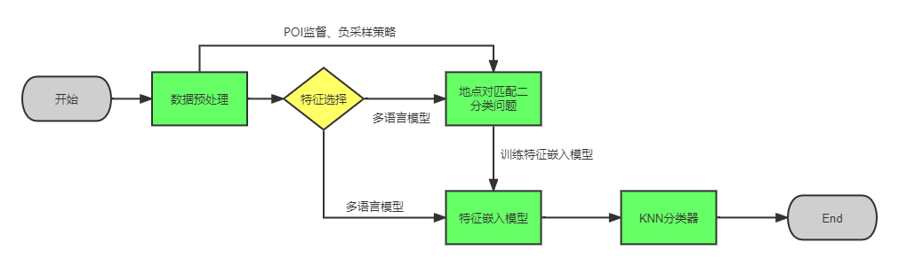
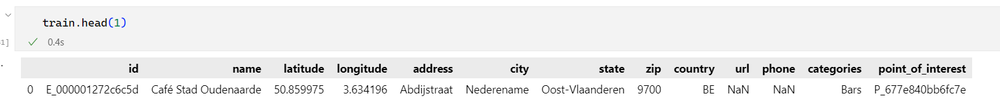

# 《机器学习》课程设计开题报告

项目组成员：2120210454  李伟，xxx  于胜龙


**注意：@于胜龙** 这个markdown格式的转成pdf，似乎有点过于占页数了，老师要求***开题报告页数不超过两页***，所以后面可能还得改成word格式。目前我前面两个部分的内容已经写好了，你后面写完了直接放到word里面调调格式就能交了。

## 一、总体思路

总体思路的pipeline如下所示：



## 三、特征描述

### 1. 数据集描述

数据集提供了包含全球数十万个POI的超过一百万个地点描述条目，具体地，数据集包含一下文件：

```json
train.csv: 训练数据集，包含超过一百万个地点描述条目，以及对应的POI
test.csv: 一组类似于训练集属性的待预测地点属性，但只有少量数据
pairs.csv: 一组预先生成的来自train.csv的地点对，用于提高对于匹配的检测能力，可以额外生成新的匹配对
sample_submission.csv: 数据提交样例
```

进一步地我们统计各个文件的数据量以及给出的属性维度数如下所示：

```json
train.csv: (1138812, 13)
test.csv: (5, 12)
sample_submission.csv: (5, 2)
pairs.csv: (578907, 25)
```

### 2. 训练数据特征描述

对于数据集我们主要关注训练数据文件，我们能够看到给定的训练数据地点信息共有1, 138, 812条，每条地点描述共有12个数据属性以及一个属性标识其对应的POI的编号。进一步我们可以得到每一条数据的数据属性如下：

对于每一个属性特征具体描述如下所示：

```tex
id: 地点描述id，由一个由E_开头的序列编号标识
name: 地点的名称，文本类型，涉及多个语言，且可能存在错误
latitude: 纬度信息，浮点数标识
longitude: 经度信息，浮点数类型标识
address: 地点所在地址描述信息，文本类型
city: 城市名称，文本类型
state: 地点所在州名称，文本类型
zip: 地点邮编，文本类型（邮编的结构多样，非数值类型）
country: 地点所在国家， 使用缩写，文本类型
url: 地点相关网页链接，超链接
phone: 地点相关的电话、手机号码，文本类型
categories: 地点的类别划分，文本类型
point_of_interest: 该地点所对应的POI编号，有一个P_开头的序列编号表示
```

更进一步地，我们检查一下训练数据各个特征维度的数据缺失率如下所示：

```text
url: 				76.49%
phone: 				69.89%
zip: 				52.28%
state: 				36.93%
address: 			34.83%
city: 				26.27%
categories: 		8.63%
country: 			0.00%
name: 				0.00%
id: 				0.00%
latitude: 			0.00%
longitude: 			0.00%
point_of_interest: 	0.00%
```

可以看到在各个特征维度的数据上，`url`的缺失率是最高的，而`latitude`, `longitude`, `name`, `country`, `categories`的缺失率相对较低，因而我们可以发现在各个特征维度上这些缺失率较低的特征保留的相对更为完整的特征信息，这是在后续的模型设计和实验设计上值得注意的点。

## 四、模型选择

## 五、实验设计
