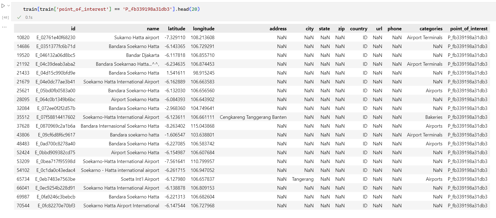

# 《机器学习》课程设计开题报告

项目组成员：2120210454  李伟，xxx  于胜龙

## 一、选题背景

当我们需要寻找或者试图去了解一个陌生地区的信息的时候，我们希望能够迅速准确的找到目标地区的相关信息，但由于互联网范围内的数据众多繁杂且质量参差不齐，这个问题变得具有一定的挑战性。此外，企业在拓广市场业务、分析重要商业布局的时候，往往也需要对特定区域的相关信息进行详尽的调研，如何从纷繁复杂的网络数据中抽取出可靠且高质量的数据至关重要。

更进一步地，上述的问题涉及到了兴趣点（Points-of-Interest, POI)的匹配和去重问题，通过搜集网络上的各个渠道的信息和数据，能够产生一个POI的大规模数据集，然而由于各个数据集来源的多元化、数据组织结构和数据质量巨大差异，数据集可能存在大量重复、噪声、非结构化、不完整和不准确的信息。为了解决上述提到的迫切的现实问题，如何通过机器学习算法和严格的人工验证方法相结合的手段提高数据集质量和消除重复数据是一个相对较好的方法。

在Foursquare Location Matching比赛中，举办方提供了超过一百万个地点条目的数据集，数据集包含大量噪声、重复、无关或者错误的数据，参赛者需要通过训练一种算法来预测哪些地点描述条目代表相同的POI。我们的工作就是寻找一种相对简洁却直观有效的方法，以尽可能确定更为准确的POI匹配项。

## 二、总体思路


## 三、特征描述

### 1. 数据集描述

数据集提供了包含全球数十万个POI的超过一百万个地点描述条目，具体地，数据集包含一下文件：

```json
train.csv: 训练数据集，包含超过一百万个地点描述条目，以及对应的POI
test.csv: 一组类似于训练集属性的待预测地点属性，但只有少量数据
pairs.csv: 一组预先生成的来自train.csv的地点对，用于提高对于匹配的检测能力，可以额外生成新的匹配对
sample_submission.csv: 数据提交样例
```

进一步地我们统计各个文件的数据量以及给出的属性维度数如下所示：

```json
train.csv: (1138812, 13)
test.csv: (5, 12)
sample_submission.csv: (5, 2)
pairs.csv: (578907, 25)
```

### 2. 训练数据特征描述和异常分析

对于数据集我们主要关注训练数据文件，我们能够看到给定的训练数据地点信息共有1, 138, 812条，每条地点描述共有12个数据属性以及一个属性标识其对应的POI的编号。进一步我们可以得到每一条数据的数据属性如下：

对于每一个属性特征具体描述如下所示：

```tex
id: 地点描述id，由一个由E_开头的序列编号标识
name: 地点的名称，文本类型，涉及多个语言，且可能存在错误
latitude: 纬度信息，浮点数标识
longitude: 经度信息，浮点数类型标识
address: 地点所在地址描述信息，文本类型
city: 城市名称，文本类型
state: 地点所在州名称，文本类型
zip: 地点邮编，文本类型（邮编的结构多样，非数值类型）
country: 地点所在国家， 使用缩写，文本类型
url: 地点相关网页链接，超链接
phone: 地点相关的电话、手机号码，文本类型
categories: 地点的类别划分，文本类型
point_of_interest: 该地点所对应的POI编号，有一个P_开头的序列编号表示
```

更进一步地，我们检查一下训练数据各个特征维度的数据缺失率如下所示：

```text
url: 				76.49%
phone: 				69.89%
zip: 				52.28%
state: 				36.93%
address: 			34.83%
city: 				26.27%
categories: 		8.63%
country: 			0.00%
name: 				0.00%
id: 				0.00%
latitude: 			0.00%
longitude: 			0.00%
point_of_interest: 	0.00%
```

可以看到在各个特征维度的数据上，`url`的缺失率是最高的，而`latitude`, `longitude`, `name`, `country`, `categories`的缺失率相对较低，因而我们可以发现在各个特征维度上这些缺失率较低的特征保留的相对更为完整的特征信息，这是在后续的模型设计和实验设计上值得注意的点。

更进一步地，我们进一步分析各个维度上的数据，尤其是完整度较高的这些维度特征的数据类型是否正确，即是否存在某些异常数据出现数据类型错误，影响后续的数据处理和模型训练，我们主要关注经纬度和地点名的数据类型，统计代码如下所示：

```python
longitudes = train['longitude'].to_list()
latitudes = train['latitude'].to_list()
ids = train['id'].to_list()
names = train['name'].to_list()
categories = train['categories'].to_list()
count = 0
for lgt, lat, id, name, cat in zip(longitudes, latitudes, ids, names, categories):
    if not pd.api.types.is_number(lgt) or not pd.api.types.is_number(lat) or not pd.api.types.is_re(re.compile(r'E_*')):
        print(lgt, lat, id, name, cat)
        count += 1
print(count/len(longitudes)* 100 , '%')
```

检验结果为0.0%的数据类型错误，即表明在这三个重要的特征维度上不存在数据类型错误的异常数据。

### 3. 训练数据重要特征维度分析

从上述分析我们能够看到部分维度的特征缺失较少，这些特征相对来说更为重要，我们进一步具体分析这些特征在相同POI上的一致性情况。

首先，我们统计训练数据中存在在所有POI的个数，以及这些POI对应的地点数量情况，统计结果如下所示：

```text
the rate of unique POIs among all: 64.98 %
unique POIs number: 739972
```

可以看到，这些数据一共描述了739, 972个不同的POI。更进一步我们统计每一个POI对应的地点描述信息条数，可以获取前20个POI如下所示：
```
index				size
P_fb339198a31db3	332
P_3a3fbd26e16269	199
P_f70a0977377171	166
P_9290e406eb58ac	145
P_fbe61733fcdebe	132
P_59cb47cbf3a432	130
P_f82d146eaf21da	120
P_40323f7f948c18	120
P_f8a0cd160eec80	119
P_6c385e5fd3a4b7	119
P_35db41d5e6fe17	115
P_9ca6f5784b5b37	115
P_16f3e1dfab51fa	106
P_ed155db12f35d7	105
P_bee1aae475d656	103
P_d2c3738f7e1882	99
P_f2f1b7b21e5b87	92
P_e953e34e177117	91
P_745299120115a1	90
P_2577c676e4ccf8	87
```

进一步地，我们关注对应地点最多的这个POI，找到她对应的其中20个地点信息如下所示：



从上图我们可以看到，这些POI的`name`属性确实比较类似，但是`latitude`和`longitude`的经纬度信息误差较大，同时`address`、`city`、`state`等属性确实较为严重，同时也能够观察到`categories`和`country`两类信息相对完整，却具有较好的一致性，但是也能够观察到`categories`属性特征在分类类别描述上上也存在一些偏差，在后续模型设计上可以考虑竟可能找到将同一个类的不同类别描述进行统一表示的方法，从而提高模型对于这些特征的利用能力。

## 四、模型选择

## 五、实验设计
